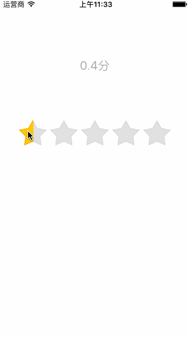

概述
---------------------------------
* 本工程主要是利用iOS 的Objective-C开发的技术要点汇总；
* 涵盖了开发中踩坑的原因，以及填坑的技术分享；
* 抛砖引玉，取长补短，希望能够提供一点思路，避免少走一些弯路。
* 注意 : 此Demo核心代码结合网络一名程序猿共同完成的,谢谢大家!

功能
--------------------------------

- 许多App都会有评价功能，这个时候或许会需要实现星级评分，下面我们来简单的实现一个星级评分功能。

要求
---------------------------------

* iOS 8+
* Xcode 8.0+

期待
---------------------------------

* 如果在使用过程中遇到BUG，希望你能Issues我，谢谢(或者尝试下载最新的代码看看BUG修复没有)。
* 如果在使用过程中发现有更好或更巧妙的实用技术，希望你能Issues我，我非常为该项目扩充更多好用的技术，谢谢。
* 如果通过该工程的使用，对您在开发中有一点帮助，码字不易，还请点击右上角star按钮，谢谢。

功能实现
---------------------------------

~~~
UILabel * lab = [self createLabelTitle:@"你没有评论呢?" andFont:15 andTitleColor:[UIColor blackColor] andBackColor:[UIColor whiteColor] andTag:100 andFrame:CGRectMake(10, 100, [UIScreen mainScreen].bounds.size.width-20, 30) andTextAlignment:NSTextAlignmentCenter];
[self.view addSubview:lab];

starView * star = [[starView alloc]initWithFrame:CGRectMake(30, 150,  [UIScreen mainScreen].bounds.size.width-60, 50)];
star.delegate = self;
[self.view addSubview:star];

[star setScore:0 withAnimation:YES completion:^(BOOL finished) {
    NSLog(@"这里可以设置相关的内容");
}];
~~~

代理方法

~~~
//代理方法
- (void)starRatingViewScore:(float)score{
    UILabel *lab = [self.view viewWithTag:100];
    lab.text = [NSString stringWithFormat:@"%0.1f分", score * 5];
}
~~~

效果图
---------------------------------

